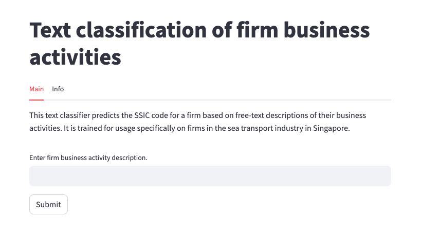

# Text classification of firm business activities

## Use Web App
Use the text classifier [here](https://ssic-classifier.streamlit.app/), deployed as a live web application using [Streamlit](https://streamlit.io/) 🎈!

## About
This project builds a text classifier to classify firms into categories of business activities (target) based on the Singapore Standard Industrial Classification (SSIC) framework, using free-text descriptions of their business activities (feature). This is done by fine-tuning and ensembling multiple pre-trained large language models (LLMs) via a model soup. 

This classifier aims to be employed in front-facing services by Singapore's Accounting and Corporate 
Regulatory Authority (ACRA) to aid new firm registrants in selecting the most appropriate SSIC code.
Further context on this use case is as follows:

In Singapore, all firms are required to register with the Accounting and Corporate Regulatory Authority (ACRA) during firm creation. During this registration, firms self-declare their Singapore Standard Industrial Classification (SSIC) code, which is the national standard for classifying economic activities, based on their planned business activities to be undertaken. 

However, 2 scenarios are common: 
(i) Firms may not select the most appropriate SSIC code at the point of registration. 
(ii) Firms may subsequently change their business activities and may not inform ACRA about this change. 
As a result, many firms' SSIC codes do not correctly reflect their business activities. 
This is a problem because the government relies on accurate firm SSIC codes for various monitoring and development purposes. 

Previously, officers manually read through each firm's business activity descriptions that are periodically collected over time through surveys, to determine if each firm's SSIC code is still reflective of its current business activities. If not, officers manually re-assign a new SSIC code to the firm.

However, this requires: 
(i) A significant amount of man hours for reading thousands of texts. 
(ii) Officers to have a good understanding of all SSIC codes, in order to correctly re-assign correct SSIC codes to firms. This is difficult as there are thousands of different SSIC codes in existence.

To resolve the above problems, this project builds a text classifier to automatically classify firms into correct SSIC codes (target) based on free-text descriptions of their business activities (feature).

## Data
This project uses firm business activity descriptions for each SSIC code, from multiple sources.

## Project Methodology
<h3>1. Pre-process text of firm business activity descriptions</h3>
- Remove instances of emails, websites, or digits that are irrelevant to activity descriptions 
- Standardize common abbreviations 
- Remove boilerplate introductions, such as "The principal activity of the company is to…"

<h3>2. Split dataset into training, validation, and test sets</h3>

<h3>3.  Augmented training text data via back-translation</h3>
Due to limited training data, we artificially generate additional text for model training that are variations of the text in the original training data, which is a method termed back-translation.  

We use <i>deep-translator</i> to translate a text from the original language (English) to a target language and then translate it back to the original language. The resulting text will be somewhat different from the original text due to translation "noise", but it conveys the same general meaning.

This introduces variations in sentence structure, word choice and phrasing, thereby diversifying the training data, enabling the model to learn from a broader range of sentence constructions and improve its ability to generalize to different inputs for better performance.

<h3>4. Select an appropriate pre-trained large language model for text classification: BERT</h3>
We use the <a href=https://huggingface.co/bert-base-uncased>bert-base-uncased model</a> on HuggingFace for transfer learning. BERT was chosen as it demonstrates state-of-the-art results when fine-tuned on a specific task even with a relatively small amount of training data. This is particularly beneficial in the context of this project, where only a limited amount of labeled data is available for training.

<h3>5. Fine-tune multiple BERT models on our specific task</h3>
We use Optuna, an open-source hyperparameter optimization framework, to fine-tune multiple BERT models with different hyperparameter configurations for learning from our training data.

<h3>6. Ensemble the fine-tuned models via model soup methodology</h3>
Model soup is a recent research breakthrough for combining multiple deep learning models into a single model through averaging the weights of each model, as outlined in the <a href=https://arxiv.org/abs/2203.05482>research paper</a>.  

We ensemble the multiple fine-tuned BERT models via this methodology to obtain an ensembled model that outperforms any single model in its "soup". This is our final model deployed.

